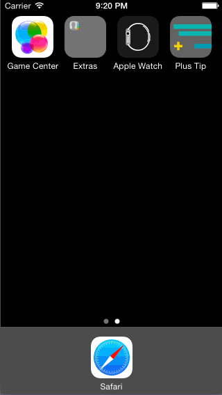

# swift-class

This is an iOS demo application for calculating gratuity

Time spent: 9 hours spent in total

Completed user stories:

 * [x] Required: User can input bill amount, select tip percentage, and see new total of bill including tip
 * [x] Optional: Displaying the amount 2-6 people need to pay if they are splittiing the bill
 * [x] Optional: Included launch image and app icon
 * [x] Optional: Styled UI: set custom font styles, edited status bar color
 * [x] Optional: Set focus on input on load of app

Walkthrough of all user stories:

GIF created with [LiceCap](http://www.cockos.com/licecap/)
